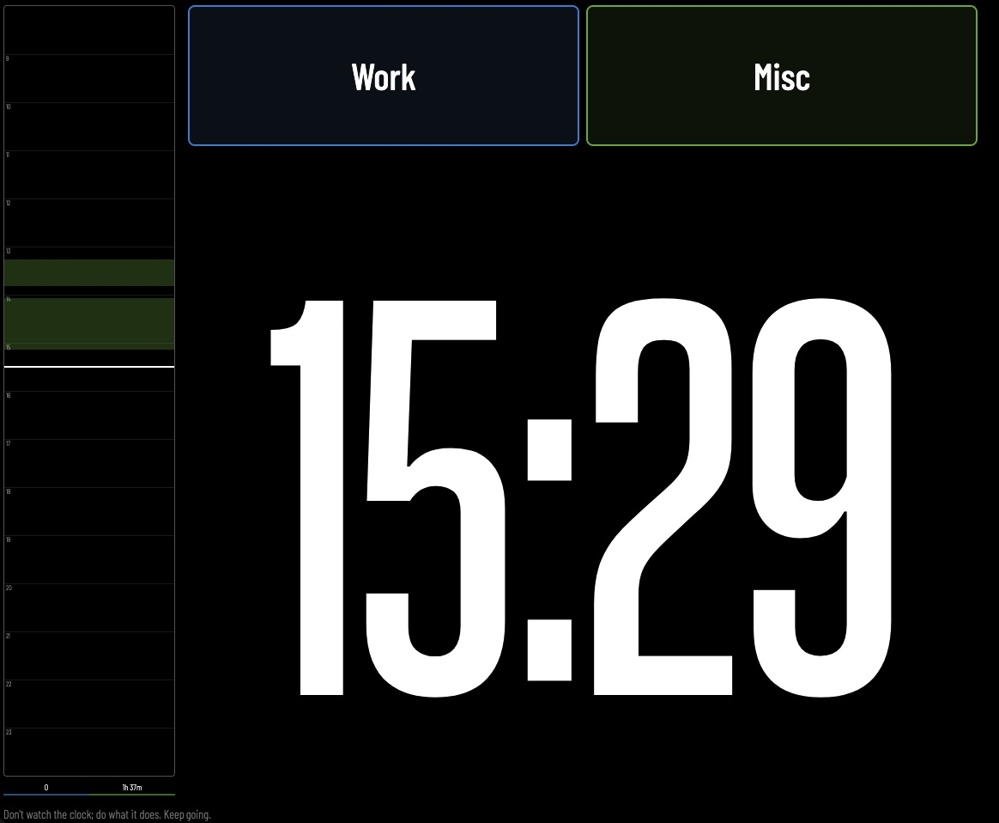

# Ropher

A minimalist Pomodoro timer with visual time tracking.

## Features

- **Duration presets** — 5, 15, 30, 35, or 45 minute sessions
- **Scopes** — Color-coded areas of focus (Work, Misc) with time summaries
- **Goals** — Set a specific objective before each session
- **Visual timeline** — See your day's work at a glance
- **Audio alerts** — Notification when time expires
- **Reminders** — Pop up when you turn the display back on; postpone one to the end of the running pomodoro
- **Fullscreen mode** — Distraction-free timer view

## Terminology

- **Scope** — The area of life you're focusing on (e.g., Work, Misc). Scopes help you track how much time you spend on different aspects of your day.
- **Goal** — The specific objective for your current session (e.g., "Finish report", "Clear inbox"). Goals keep you focused during a single Pomodoro.
- **Reminder** — Something to do when you come back to the device (e.g., "Shoulder exercise"). Reminders are off by default; add them in Settings, where each one can be turned off, re-timed, or deleted forever. **Done** dismisses it until it is due again, **Postpone** brings it back the moment the pomodoro timer ends.
